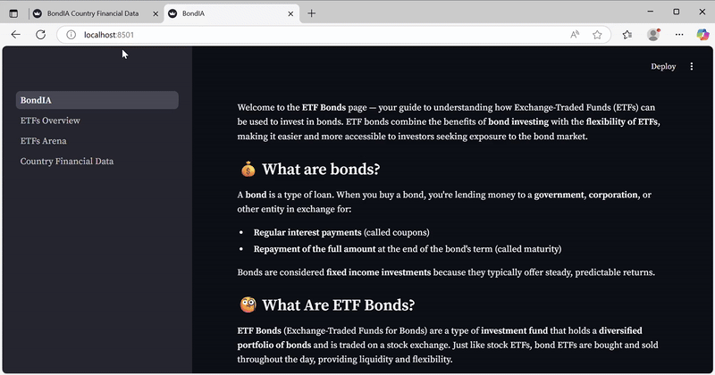
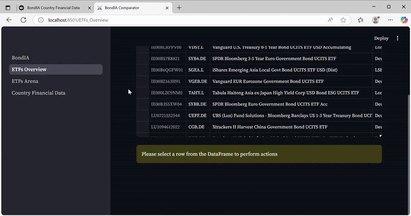
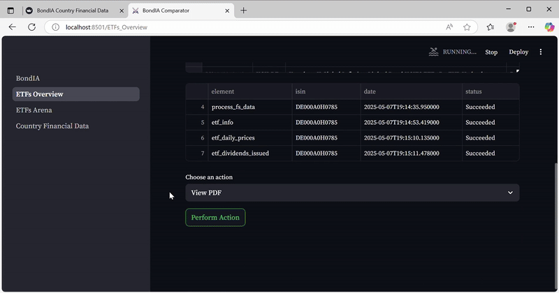
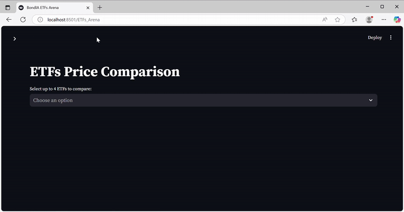
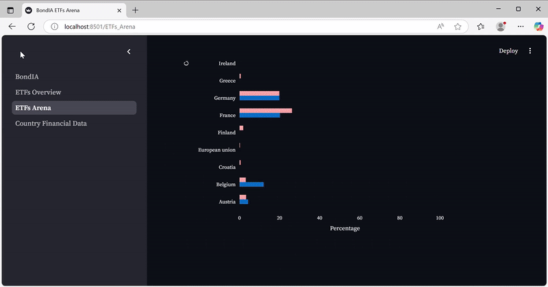

  

<h1 align="center">ETF Bond Comparison Application</h1>

This is a Python-based application designed to compare bond ETFs by accessing and analyzing their factsheet information. The project uses Docker to orchestrate its services, which include a MongoDB database, a FastAPI backend, and a Streamlit frontend for visualization.

  
  
  
  
  
  

---

## Project Structure

. 
├── docker-compose.yml 
├── .env 
├── fastapi-app/ 
│ └── Dockerfile 
└── streamlit-app/ 
└── Dockerfile

---

## Services Overview

- **MongoDB**: Stores ETF and factsheet data.
- **FastAPI App**: Backend API for data processing and comparison logic.
- **Streamlit App**: Frontend UI for users to interact and visualize ETF comparisons.

---

## Environment Variables (`.env` file)

You need to create a `.env` file in the root directory of the project (same level as `docker-compose.yml`).  
This file will store sensitive information and configuration variables used by the services.

### Example `.env` file

MONGO_INITDB_ROOT_USERNAME=your_mongo_username
 
MONGO_INITDB_ROOT_PASSWORD=your_mongo_password
 
LLAMA_CLOUD_API_KEY=llama_cloud_api

**Note:**  
- Replace `your_mongo_username` and `your_mongo_password` and `llama_cloud_api`  with secure values.  
- Do NOT commit your `.env` file to public repositories.

---

## How to Run the Application

### 1. Clone the Repository

### 2. Create the `.env` File

Create a `.env` file in the root directory as described above.

### 3. Build and Start the Services

docker-compose up --build

- This command will build the FastAPI and Streamlit images and start all services.  
- The first build may take a few minutes.

### 4. Access the Application

- **Streamlit Frontend:** [http://localhost:8501](http://localhost:8501)  
- **FastAPI Docs:** [http://localhost:8000/docs](http://localhost:8000/docs)  
- **MongoDB:** Accessible internally within the Docker network.

### 5. Stopping the Application

To stop the services, press `Ctrl+C` in the terminal where Docker is running, then:

docker-compose down

---

## Volumes

- `mongo_data`: Persists MongoDB data across container restarts.  
- `data`: Used by the FastAPI app to store any relevant data.

---

## Networks

- All services communicate over the `app-network` Docker network.

---

## Notes

- Ensure Docker and Docker Compose are installed on your system.

## DEMO

### Bonds Introduction Page

### Select and process one ETF

### View ETF Factsheet

### Compare different ETFs

### Countries Financial Data

